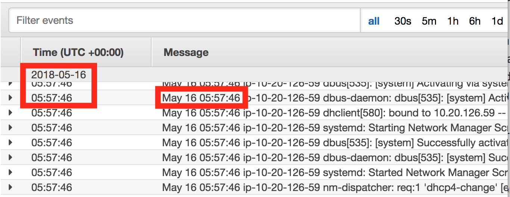

# CloudWatch Logs Agent Tips and Tricks

## Introduction
[CloudWatch Logs](https://docs.aws.amazon.com/AmazonCloudWatch/latest/logs/WhatIsCloudWatchLogs.html) is a great place to aggregate your logs from your EC2 instances
so you can monitor and alert on errors in your applications. Especially if you
are using Auto Scaling, EC2 instances will come and go and you will lose log
events unless you ship them to CloudWatch from your instances.

In addition to being a place to aggregate application log events, you can use
CloudWatch to set up alerts and build dashboards. "For example, CloudWatch Logs
can track the number of errors that occur in your application logs and send you
a notification whenever the rate of errors exceeds a threshold you specify."
("What is Amazon CloudWatch Logs" documentation)

In this post I'll show you a couple of tips and tricks to collect logs from your
instances and ship them to CloudWatch.

## Install the Unified CloudWatch Agent

In this article, we'll be talking about the newer [unified CloudWatch Agent](https://docs.aws.amazon.com/AmazonCloudWatch/latest/monitoring/Install-CloudWatch-Agent.html),
which has replaced the older CloudWatch Logs agent. It allows you to collect EC2
instance logs and metrics and ship them to CloudWatch.

I recommend the AWS docs to [install and configure the unified CloudWatch
agent](https://docs.aws.amazon.com/AmazonCloudWatch/latest/monitoring/Install-CloudWatch-Agent.html).
There are four steps to install and configure the CloudWatch agent: create an
IAM role your instances will use to export logs to CloudWatch, install the
agent, create the configuration file, and start the agent.

The hardest part is getting the agent configuration file correct so log events
show up in the right Log Group and CloudWatch timestamps match individual
log event timestamps.

## Creating the Agent Configuration File

The CloudWatch agent gets its log and metric collection [configuration from a
file](https://docs.aws.amazon.com/AmazonCloudWatch/latest/monitoring/CloudWatch-Agent-Configuration-File-Details.html)
in the CloudWatch agent directory.

I have found that the [CloudWatch Agent configuration file
wizard](https://docs.aws.amazon.com/AmazonCloudWatch/latest/monitoring/create-cloudwatch-agent-configuration-file-wizard.html)
does a pretty good job of generating the initial configuration and I highly recommend you
run it. However, if you are using the
CloudWatch agent primarily for log forwarding, you'll need to edit the config file
by hand.

Here's an example CloudWatch agent `logs` section from a Couchbase server. For a
real Couchbase server, you'd need to monitor most of the logs in the
`couchbase/logs/` directory.

```JSON
"logs": {
        "logs_collected": {
            "files": {
                "collect_list": [
                    {
                        "file_path": "/var/log/messages",
                        "log_group_name": "myapp/db/messages",
                        "timestamp_format": "%b %d %H:%M:%S"
                    },
                    {
                        "file_path": "/opt/couchbase/var/lib/couchbase/logs/http_access.log",
                        "log_group_name": "myapp/db/couchbase/http_access",
                        "timestamp_format": "%d/%b/%Y:%H:%M:%S %z"
                    }
                ]
            }
        }
    },
```

There are two potentially tricky settings, the `log_group_name` and the `timestamp_format`.

## Log Group Name

The Log Group name is a way of grouping logs from related EC2 instances. For
example you might group your app's web server `http_access` logs together into a
single log group called `myapp/web/http_access`. You should aim for one log
group per app/tier/log, e.g. `myapp/web/http_access` vs `myapp/web/messages`.

## Why you should specify a timestamp_format

The `timestamp_format` field is listed as optional in the [CloudWatch Agent
Configuration](https://docs.aws.amazon.com/AmazonCloudWatch/latest/monitoring/CloudWatch-Agent-Configuration-File-Details.html)
but it should be considered mandatory. In the docs it says, "If you omit this
field, the current time is used", but it's not immediately clear why that's a
problem. If don't specify a `timestamp_format` for your log file, when
CloudWatch ingests your log, each log line is time-stamped with the time
_that log line was ingested_, not the actual log event time. For example if the
first line in the log file has a timestamp of `2018-06-03`, and today is
`2018-06-07`, that line will be timestamped `2018-06-07` since that's the
date/time the log was ingested into CloudWatch. This makes it very hard to do
accurate event correlation across logs, or accurately alert on errors in logs when they happen.

When you correctly specify the `timestamp_format`, the Time column and the
timestamp in the Message column will match:



## How to specify a timestamp_format

Specifying a timestamp format is pretty straightforward once you've done it a
couple of times. The important thing to note is that it's not a regexp. You
should copy a timestamp from your log file and replace the year, month, day,
time fields with the special symbols listed in the [CloudWatch Agent
Configuration File: Logs
Section](https://docs.aws.amazon.com/AmazonCloudWatch/latest/monitoring/CloudWatch-Agent-Configuration-File-Details.html),
e.g. %Y, %b, etc. See the CloudWatch agent configuration file snippet above for
two examples.

## Summary

The CloudWatch agent is a good tool to ship logs and metrics from the EC2
instances which make up your application to CloudWatch. This allows you to
aggregate logs across instances and app tiers, set up alerts when you reach
certain error thresholds (e.g. too many 500 errors in a 5 min period), and
create monitoring dashboards for business applications.

I showed you how to create the agent configuration file, including how to
specify log group names, and why the timestamp format is a mandatory field in
your agent config file.

I hope this helps you get started with the CloudWatch agent for your EC2-based
apps.

Do you need help setting up CloudWatch logs? 1Strategy can help! Please feel free to contact us or shoot us an email at info@1Strategy.com to get more information.
